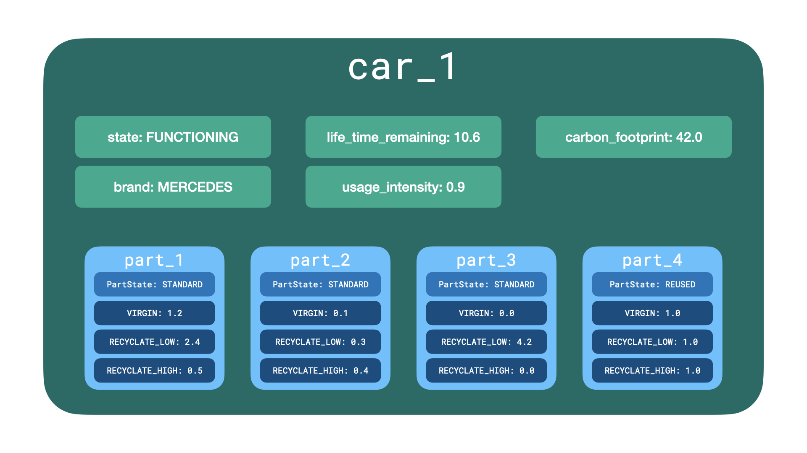

# The CEPAI Model

The Circular Economy of Plastic in the Automotive Industry (CEPAI) Model is an agent-based simulation model that concerns the circular economy of plastic in the automotive industry within the Netherlands. 

## Contributors
- Max Reddel
- Felicitas Reddel
- Anmol Soni
- Ryan van der Plas


## Table of Contents
1. [General Remarks](#1-general-remarks)
2. [Current State of the Project](#2-current-state-of-the-project)
3. [Repository Structure](#3-repository-structure)
4. [The CEPAI Model](#4-the-cepai-model)
   1. [Agents](#41-agents)
   2. [Model Flow](#42-model-flow)
   3. [Components](#43-components)
   4. [Cars and Parts](#44-the-composition-of-cars-and-parts)
5. [XLRM Framework](#5-xlrm)
   1. [KPIs](#51-kpis)
   2. [Policies](#52-policies)
   3. [Scenarios](#53-scenarios)
    

## 1. General Remarks

This is a project for the course SEN9120 Advanced Agent Based Modelling (2021/22 Q2) at TU Delft in collaboration with the RIVM.

---

## 2. Current State of the Project

### 2.1 Changes in Stages and Steps

We ran into quite some problems with the two-stage-process of the agents. The potential solutions were not pretty. One such solution would have consisted in creating something like a `MarketAgent` which would take care of determining who gets what components from whom. Additional stages would have been necessary as well for this. To keep the design simple, we went back to square one and created a new design.

Now, the `GenericAgent` has the following three stages:
- `get_all_components()` which gets or buys components from the agent's corresponding suppliers.
- `process_components()` which manufactures, uses, or repairs specific components.
- `update_demand()` which updates the agent's demand for the next instant.

#### Example
Let's say for instance, a `PartsManufacturer` `pm1` is activated. This agent wants first to buy plastic from the `Refiner`s and `Recycler`s. The agent `pm1` will compute its preferences and thus determine to which supplier `pm1` wants to go to first to attempt to buy a specific kind of plastic. Then, it will go through the suppliers according to these preferences. When `pm1` is done with buying all plastic that it demands, it can execute the second step. Now, `pm1` will manufacture parts out of plastic. In the last step, `pm1` will adjust its demand for the next instant. When `pm1` is all done, the next `PartsManufacturer` can be activated and so on. 

### 2.2 Changes in Components

Earlier, we had `PlasticType` where we had `REUSE`, `VIRGIN`, `RECYCLATE_LOW`, and `RECYCLATE_HIGH`. However, we needed to restructure a bit as we also want to include parts and cars. For this purpose, we have now components (see section on [Cars and Parts](#44-the-composition-of-cars-and-parts)).

### 2.3 Changes in Agents

Agents have also received some adjustment treatment. `CarDesigner`s and `LogisticCompany`s have been kicked out completely (see section on [Agents](#41-agents)). The reasons for excluding the latter one lies in the fact that a `LogisticCompany` does not do much. It is only receiving `Part`s but not processing them at all. The idea is now to aggregate them away and have a direct connection between the `PartsManufacturer`s and the `Garage`s.

### 2.4 Still to do

1. Add more details to the following agents:
   - `Dismantler`
      - `process_components` method is implemented. It Dismantles the car, reuses the STANDARD parts and adds them to the stock. However, I am not sure what do with the dismantled cars. Since, there is no plastic left, there is no point in sending it to shredders (in the model implementation). However, we can send the the reused parts extracted from the car to recyclers. I am not sure about how to implement this but we can discuss it during our next meeting.

   - `Garage`
   - `Recycler`
      - __init__ is redified to inlcude `demand` and `default_demand`. Recyclers have demand for both CARS and PARTS. Recycler revieve CARS from Garages and PARTS (reused) from Dismantler. 
      - `process_components` method is implemented. This function extracts the plastic from both CARS and PART. VIRGIN plastic present in the parts is recycled as RECYCLATE_HIGH. RECYCLATE_HIGH present in the parts is extracted and is converted into RECYCLATE_LOW. RECYCLATE_LOW in components is discareded.
   - `User`
2. Implement `process_components()` for all agents
3. Implement `update_demand()` for all agents

PS: These implementations are not tested completly because Garage is not implememted in this branch yet. Also, I need someone to evaluate the code as I am not ver familiar with this style of code and using enum. Lastly, I tried and am willing to learn.


---
## 3. Repository Structure

```
./QONNECT/
├── examples                  # Contains examples on how to run the model
│   ├── simulation.ipynb   
│   └── simulation.py                    
├── images
├── model                                 
│   ├── agents.py             # Contains all agents
│   ├── cepai_model.py        # Contains main model
│   ├── bigger_components.py  # Contains classes for Parts and Cars
│   ├── enumerations.py       # Contains custom-made enumerations (Component, PartState, CarState, Brand)
│   └── preferences.py        # Contains a Preferences class to determine which supplier an agent prefers
└── README.md          
```

The `model` directory contains all model relevant components, including the main model `cepai_model.py`, `agents.py`, `bigger_components`, `enumerations`, and `preferences`. You can run the model by using the notebook `simulation.ipynb` or the script `simulation.py` from the `examples` directory. 

---
## 4. The CEPAI Model

### 4.1 Agents

Every single agent inherits its attributes and methods from `GenericAgent`. A list of these agents is provided in the following table.

(The values in the `Count` column are only suggestions for now.)

| Agent Type          | Count | Description                                                                                                   |
|---------------------|-------|---------------------------------------------------------------------------------------------------------------|
| `User`              | 1000  | A user of a car.                                                                                              |
| `CarManufacturer`   | 4     | A facility that manufatures cars of a specific car brand with brand ϵ {VW, GM, Toyota, Mercedes}.             |
| `PartsManufacturer` | 10    | A facility (= parts manufacturer or original equipment manufacturer) who takes plastic in and produces parts. |
| `Refiner`           | 6    | A facility (= miners and refiners) that produces virgin plastic.                                               |
| `Recycler`          | 4     | A facility (= shredder and post-shredder) that creates recyclate.                                             |
| `Dismantler`        | 2     | A facility that dismantles cars.                                                                              |
| `Garage`            | 20    | A facility that repairs cars or sends them for final processing.                                              |
<figcaption align = "center"><b>Tab.1 - Agents</b></figcaption>


### 4.2 Model Flow 

Figure 1 shows the various agents in this network and how several kinds of components (plastic, parts, and cars) flow through the network.


<figcaption align = "center"><b>Fig.1 - Material flow between the agents</b></figcaption>

### 4.3 Components

The enumeration `Component` defines that there are different kinds of plastics, but also parts and cars. This comes in handy when dealing with polymorphic methods that handle stock and demand. The table below shows the different values in the first column. For the plastics, it is the case that both data types for stock and demand are floats. We refer here to mass in e.g., kilogram or tonnes. The data types for `PARTS` and `CARS` differs. A `Part` is a custom-made object that consists of a ratio of plastics and a state `PartState` which is either `STANDARD` or `REUSED`. A `Car` consist mainly of a number of `Part`s. So, the stocks for these two components are lists because they contain these objects. Their demand data types are integers, however. **And this has to be adjusted further!** 

Currenlty, everything works. But for `PARTS` and `CARS`, it's a simple way of just stating how many parts and how many cars an agent wants/demands. We need to discuss how we want to proceed here.

| Component        | Stock Data Type | Demand Data Type |
|------------------|-----------------|------------------|
| `VIRGIN`         | float           | float            |
| `RECYCLATE_LOW`  | float           | float            |
| `RECYCLATE_HIGH` | float           | float            |
| `PARTS`          | list            | int              |
| `CARS`           | list            | int              |
<figcaption align = "center"><b>Tab.2 - Components and their data types</b></figcaption>

### 4.4 The Composition of Cars and Parts

Figure 2 shows what an instance of the `Car` class can look like. Additionally, we can see what a `Part` consists of. The number of parts can of course still be adjusted. 


<figcaption align = "center"><b>Fig.2 -The composition of cars and parts</b></figcaption>


## 5. XLRM

The XLRM framework describes the analysis of a model by distinguishing:
- X: Uncertainty variables which define the Scenarios
- L: Lever varaibles which define the policies or solutions
- R: Relations which describe the inner working of the model
- M: Metrics which define the key performance indicators (KPIs)

The following sub-sections describe X, L, and M in more detail.

### 5.1 KPIs
### 5.2 Policies
### 5.3 Scenarios
