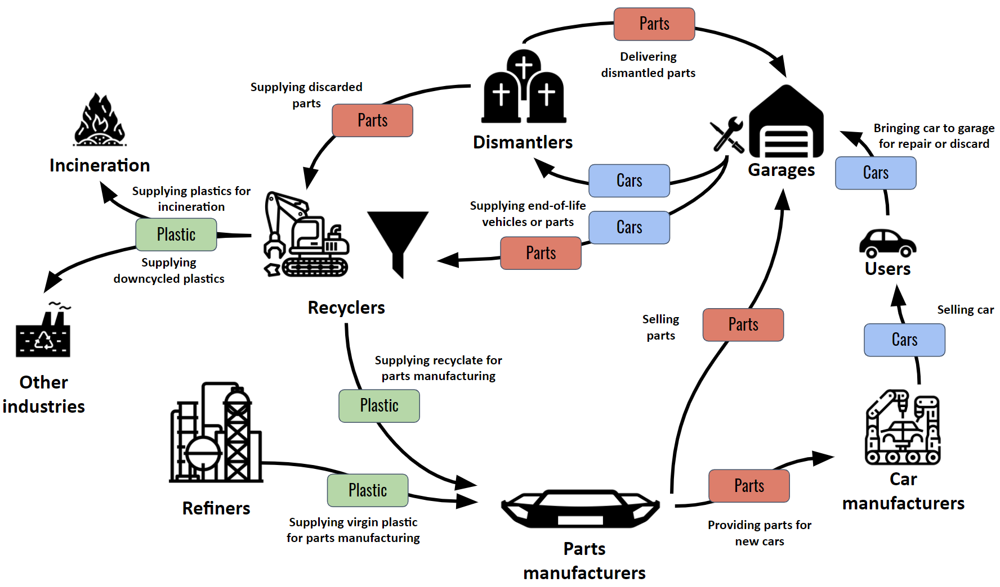
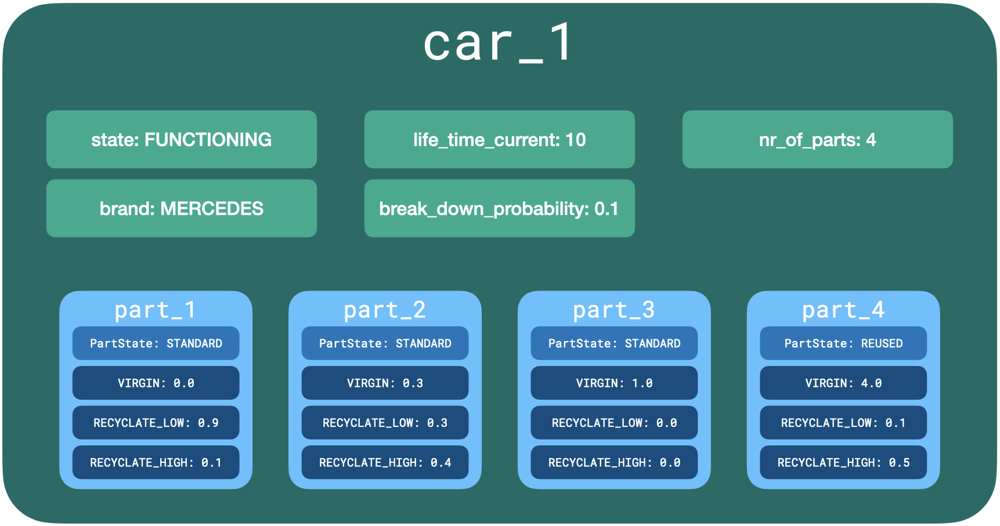
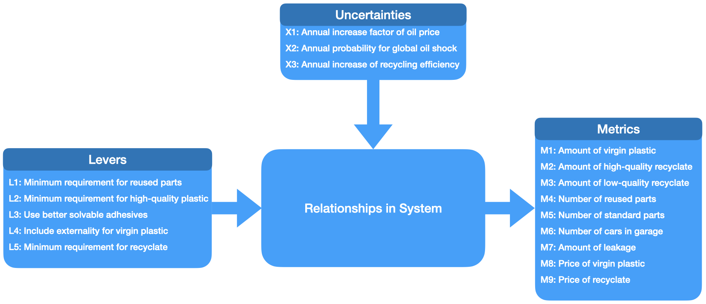

# The CEPAI Model

The Circular Economy of Plastic in the Automotive Industry (CEPAI) Model is an agent-based simulation model that concerns the circular economy of plastic in the automotive industry within the Netherlands. Experiments have been run on a small scale due to limitations of computing power. 

## Contributors
- Max Reddel
- Felicitas Reddel
- Anmol Soni
- Ryan van der Plas

## Running the model

Import the model with: 
```from model.cepai_model import *```

Set the parameters: 

```
levers = {
  "L1": 0.1,  # Minimal requirement for reused parts
  "L2": 0.1,  # Minimal requirement for high-quality plastic
  "L3": 1.0,  # Use better solvable cohesives
  "L4": 1.0,  # Include externality for virgin plastic
  "L5": 0.3  # Minimal requirement for recyclate
}

uncertainties = {
  "X1": 1.0,  # Annual increase factor of oil price
  "X2": 0.0,  # Annual probability for global oil shock
  "X3": 1.0  # Annual increase of recycling efficiency
}
```

Create and run the model:
```
model = CEPAIModel(levers, uncertainties)
model.run(steps=50, time_tracking=True)
```

An example script can be found in the directory `examples/simulation.py`.

---

## Table of Contents
1. [General Remarks](#1-general-remarks)
2. [Current State of the Project](#2-current-state-of-the-project)
3. [Repository Structure](#3-repository-structure)
4. [The CEPAI Model](#4-the-cepai-model)
   1. [Agents](#41-agents)
   2. [Model Flow](#42-model-flow)
   3. [Components](#43-components)
   4. [Cars and Parts](#44-the-composition-of-cars-and-parts)
5. [XLRM Framework](#5-xlrm)
   1. [Metrics](#51-kpis)
   2. [Levers](#52-policies)
   3. [Uncertainties](#53-scenarios)
    

## 1. General Remarks

This is a project for the course SEN9120 Advanced Agent Based Modelling (2021/22 Q2) at TU Delft in collaboration with the RIVM. It is an Agent-based model developed for virtually testing policy effectiveness. The model is very modular and easily extendable.

## 2. Current State of the Project

Models come with limitations: they can not cover all aspects of real-life, but they can cover the most important aspects. The current implementation will be briefly discussed to give clarity of what is included.

### 2.1 Stages and Steps

To keep the design simple, a [StagedActivation](https://mesa.readthedocs.io/en/stable/apis/time.html) of the [Mesa](https://mesa.readthedocs.io/en/stable/overview.html) library in Python has been used for agent activation. This means that for all agents in a random order, a stage will be executed before going to the next stage in the time-step. Currently, there are three stages.

The `GenericAgent`, the superclass of all agents, has the following three stages:
- `get_all_components()` which gets or buys components from the agent's corresponding suppliers.
- `process_components()` which manufactures, uses, or repairs specific components.
- `update()` which updates the agent's demand for the next instant.

#### Example

For illustration purposes, let's say for instance, a `PartsManufacturer` `pm1` is activated. This agent wants first to buy plastic from the `Refiner`s and `Recycler`s. The agent `pm1` will compute its preferences and thus determine to which supplier `pm1` wants to go to first to attempt to buy a specific kind of plastic. Then, it will go through the suppliers according to these preferences. When `pm1` is done with buying all plastic that it demands, it is the turn of the next `PartsManufacturer` `pm2`. When all agents executed the first stage, the second stage starts for all agents. When it is `pm1`'s turn, it will manufacture parts out of plastic (the analogous is the case for all other agents). In the last step, every agent will adjust its demand for the next instant.


### 2.2 Components Specification

Earlier, we had `PlasticType` where we had `REUSE`, `VIRGIN`, `RECYCLATE_LOW`, and `RECYCLATE_HIGH`. However, we needed to restructure a bit as we also want to include parts and cars. For this purpose, we have now components (see section on [Cars and Parts](#44-the-composition-of-cars-and-parts)).

For materials flowing in the supply chain, components have been defined. Basically this means that distinctions are made between `CARS`, `PARTS`, `VIRGIN`, `RECYCLATE_HIGH` and `RECYCLATE_LOW` plastics. `CARS` are composed of N `PARTS` which are in turn composed of the different kinds of plastics. `PARTS` can be either `STANDARD` or `REUSED`. `CARS` are `FUNCTIONING` when in use, `BROKEN` when in need for repair and `END_OF_LIFE` when they reached the lifetime of the car.

### 2.3 Agents

Below a brief description of agents and their stages:
   - `Dismantler` 
      - `get_all_components`: A `Dismantler` will accept all `Cars` from the `Garage`.    

      - `process_components`: It Dismantles the `Cars`, reuses the `STANDARD` `Parts` and adds them to the stock. As per the current version, all every `Part` is reused only once. All the reused `Parts` are sent to the `Recycler`.
        
      - `update`: Updates prices of parts to be reused according to the demand.

   - `Recycler`
      - `get_all_components`: A `Recycler` will accept all `Cars` and parts from the `Garage` and `Dismantler`.    

      - `process_components`: Plastics are extracted from `Cars` and `Parts`. The `efficiency` of the recycler determines how often plastic can be recycled without degrading in quality. 
        
      - `update`: Updates prices of recyclate.  
      
   - `Refiner`
      - `get_all_components`: A `Refiner` has unlimited supply in the model.

      - `process_components`: A `Refiner` just delivers virgin plastics, the process of creating plastics out of base materials is out of the model scope.
        
      - `update`: Updates prices of virgin plastics.  
      
   - `Parts Manufacturer`
      - `get_all_components`: A `Parts Manufacturer` will get virgin plastics and recyclate to produce plastic `Car` parts with.   

      - `process_components`: Plastic `Parts` are created of the plastic base materials.
        
      - `update`: Updates prices of `Parts` and demand for its `Parts` and the demand for base materials needed to produce these `Parts`.
      
   - `Car Manufacturer`
      - `get_all_components`: A `Car Manufacturer` will get `Parts` to produce `Cars`.  

      - `process_components`: `Cars` are assembled out of `Parts`.
        
      - `update`: Updates prices of `Cars`, demand for `Cars` and demand for `Parts` needed to produce these `Cars`.
      
   - `User`
      - `get_all_components`: A `User` buys a `Car` in case it has no `Car`.   

      - `process_components`: The `User` uses the `Car`. In case the `Car` is `BROKEN` the user brings the `Car` to a garage.
        
      - `update`: Does nothing.
      
   - `Garage`
      - `get_all_components`: A `Garage` gets `Parts` for repairing `Cars`.  

      - `process_components`: `Cars` are repaired and returned to the rightful owner, the `User`.
        
      - `update`: Updates prices for repair of `Cars` and its demand for `Parts`.
      
   
   


---
## 3. Repository Structure

```
./QONNECT/
├── evidence_files                # Contains information on the verification and validation of the model
├── examples                      # Contains examples on how to run the model
│   ├── model_calibration.ipynb   # A notebook for calibrating the model's starting values  
│   └── simulation.py             # Example of how to run the model
├── experiments
│   ├── output                    # Contains output data of the experiments
│   ├── outputimages              # Contains the images generated in the data visualization
│   ├── experiment.py             # Contains the experiments
│   └── results.ipynb             # Contains data visualizations of the experiments
├── images                        # Contains images for the report
├── model                                 
│   ├── agents.py                 # Contains all agents
│   ├── cepai_model.py            # Contains main model
│   ├── bigger_components.py      # Contains classes for Parts and Cars
│   ├── enumerations.py           # Contains custom-made enumerations (Component, PartState, CarState, Brand)
│   └── preferences.py            # Contains a Preferences class to determine which supplier an agent prefers
└── README.md          
```

The `model` directory contains all model relevant components, including the main model `cepai_model.py`, `agents.py`, `bigger_components`, `enumerations`, and `preferences`. You can run the model by using the script `simulation.py` from the `examples` directory. Running the same experiments can be done running the script `experiment.py` in the `experiments` directory. Consequently, the data can be visualized with the `results.ipynb` notebook.

## 4. The CEPAI Model

### 4.1 Agents

Every single agent inherits its attributes and methods from `GenericAgent`. A list of these agents is provided in the following table.

(The values in the `Count` column are only suggestions for now.)

| Agent Type          | Count | Description                                                                                                   |
|---------------------|-------|---------------------------------------------------------------------------------------------------------------|
| `User`              | 1000  | A user of a car.                                                                                              |
| `CarManufacturer`   | 4     | A facility that manufatures cars of a specific car brand with brand ϵ {VW, GM, Toyota, Mercedes}.             |
| `PartsManufacturer` | 3     | A facility (= parts manufacturer or original equipment manufacturer) who takes plastic in and produces parts. |
| `Refiner`           | 3     | A facility (= miners and refiners) that produces virgin plastic.                                              |
| `Recycler`          | 1     | A facility (= shredder and post-shredder) that creates recyclate.                                             |
| `Dismantler`        | 1     | A facility that dismantles cars.                                                                              |
| `Garage`            | 2     | A facility that repairs cars or sends them for final processing.                                              |
<figcaption align = "center"><b>Tab.1 - Agents</b></figcaption>


### 4.2 Model Flow 

Figure 1 shows the various agents in this network and how several kinds of components (plastic, parts, and cars) flow through the network. Normally, leftover recyclate would be used by other industries or for incineration. This flow is shown in the diagram, but not included in the model for reducing complexity.


<figcaption align = "center"><b>Fig.1 - Material flow between the agents</b></figcaption>


### 4.3 Components

The enumeration `Component` defines that there are different kinds of plastics, but also parts and cars. This comes in handy when dealing with polymorphic methods that handle stock and demand. The table below shows the different values in the first column. For the plastics, it is the case that both data types for stock and demand are floats. We refer here to mass in e.g., kilogram or tonnes. The data types for `PARTS` and `CARS` differs. A `Part` is a custom-made object that consists of a ratio of plastics and a state `PartState` which is either `STANDARD` or `REUSED`. A `Car` consist mainly of a number of `Part`s. So, the stocks for these two components are lists because they contain these objects. Their demand data types are integers, however. 

| Component        | Stock Data Type | Demand Data Type |
|------------------|-----------------|------------------|
| `VIRGIN`         | float           | float            |
| `RECYCLATE_LOW`  | float           | float            |
| `RECYCLATE_HIGH` | float           | float            |
| `PARTS`          | list            | int              |
| `CARS`           | list            | int              |
| `DISCARDED_PARTS`| list            | int              |
| `CARS_FOR_DISMANTLER`| list        | int              |
| `CARS_FOR_SHREDDER`| list          | int              |
<figcaption align = "center"><b>Tab.2 - Components and their data types</b></figcaption>

### 4.4 The Composition of Cars and Parts

Figure 2 shows what an instance of the `Car` class can look like. Additionally, we can see what a `Part` consists of. The number of parts can of course still be adjusted in the model parameters.


<figcaption align = "center"><b>Fig.2 -The composition of cars and parts</b></figcaption>


## 5. XLRM

The XLRM framework describes the analysis of a model by distinguishing:
- X: Uncertainty variables which define the Scenarios
- L: Lever varaibles which define the policies or solutions
- R: Relations which describe the inner working of the model
- M: Metrics which define the key performance indicators (KPIs)

The following sub-sections describe X, L, and M in more detail. An overview is provided here:


<figcaption align = "center"><b>Fig.3 -The XLRM framework applied to the CEPAI model</b></figcaption>

### 5.1 Metrics
   - `M1`: Amount of virgin plastic. This equals the amount of virgin plastics in cars.
   - `M2`: Amount of high-quality recyclate. This equals the amount of high-quality recyclate in cars.
   - `M3`: Amount of low-quality recyclate. This equals the amount of low-quality recyclate in cars.
   - `M4`: Number of reused parts. This equals the number of reused parts in cars.
   - `M5`: Number of standard parts. This equals the number of standard parts in cars which are not reused.
   - `M6`: Number of cars in garage. This equals the number of cars in the garage.
   - `M7`: Amount of leakage. This equals the outflow of plastics which can not be used for producing parts in the car industry again.
   - `M8`: Price of virgin plastic. This equals the average price of virgin plastics over all suppliers.
   - `M9`: Price of recyclate. This equals the average price of recyclate over all suppliers.

### 5.2 Levers
   - `L1`: Minimum requirement for reused parts. This policy applies to garages. It specifies the relative amount of reused parts garages have to use for repairing cars.
   - `L2`: Minimum requirement for high-quality plastic. This policy applies to parts manufacturers. It specifies the relative amount of high-quality recyclate to be used for producing new parts.
   - `L3`: Use better solvable adhesives. This policy applies to the design of cars/parts and to the production of them. However, it influences the recycler in the model. If better solvable adhesives are used for production, the process of recycling plastic becomes more efficient and more plastics can be recycled.
   - `L4`: Include externality for virgin plastic. This policy applies to refiners. It makes virgin plastics more expensive. In the current model implementation, parts manufacturers actually do not make a trade-off between recyclate and virgin plastics. Therefore, this policy has no influence but with the current model it could have influence if this trade-off is included.
   - `L5`: Minimum requirement for recyclate. This policy applies to parts manufacturers. Instead of specifying the relative amount of high-quality recyclate to be used for producing new parts, it specifies the relative amount of any recyclate to be used.

### 5.3 Uncertainties

   - `X1`: Annual increase factor of oil price. The world runs out of oil, a base material which is primarily used for producing plastics. It makes virgin plastics more expensive. 
   - `X2`: Annual probability for global oil shock. A probability which increases the oil price suddenly because of an event. It makes virgin plastics more expensive.
   - `X3`: Annual increase of recycling efficiency. There is technological process in the plastic recycling/production industry. Either recycling processes may become more efficient of products better recyclable, both leading to a higher efficiency of recycling.
